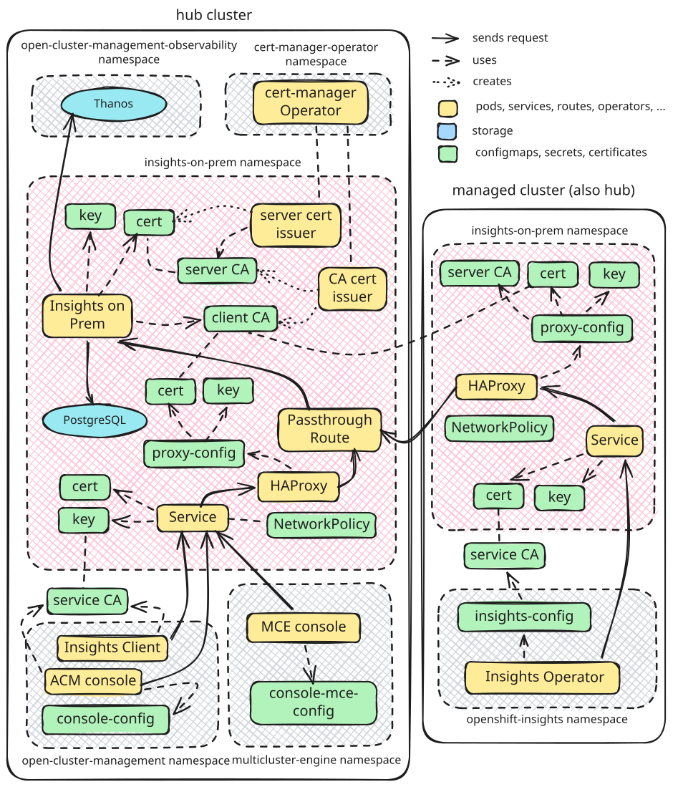

# Insights on Premise

Insights on Premise aims to provide recommendations based on Insights archives in environments that **cannot reach console.redhat.com**. Specifically it is designed to be deployed in ACM clusters and for providing rule-based recommendations for managed clusters.


## Contents

- [Insights on Premise](#insights-on-premise)
  - [Contents](#contents)
  - [Deployment to ACM Cluster](#deployment-to-acm-cluster)
    - [Prerequisites](#prerequisites)
    - [Deployment steps](#deployment-steps)
      - [Secrets](#secrets)
      - [Configuration](#configuration)
    - [Verify Deployment](#verify-deployment)
  - [Viewing Results in the ACM Console](#viewing-results-in-the-acm-console)
  - [On-Demand Data Gathering](#on-demand-data-gathering)
    - [How to Trigger](#how-to-trigger)
    - [Monitoring](#monitoring)
    - [Cleanup](#cleanup)
  - [Triggering Sample Results](#triggering-sample-results)
    - [Upgrade risk predictions](#upgrade-risk-predictions)
    - [Cluster recommendations](#cluster-recommendations)
  - [Architecture](#architecture)
    - [Data Flow](#data-flow)
    - [Security](#security)
      - [Certificate Management](#certificate-management)
      - [Network Policies](#network-policies)
  - [Database Access](#database-access)
  - [API Endpoints](#api-endpoints)
    - [Upload Archive](#upload-archive)
    - [Get Cluster Report](#get-cluster-report)
    - [Batch Upgrade Risk Predictions](#batch-upgrade-risk-predictions)
    - [Get Request Processing Status (on-demand data gathering)](#get-request-processing-status-on-demand-data-gathering)
    - [Get Request Report (on-demand data gathering)](#get-request-report-on-demand-data-gathering)
    - [Health Check](#health-check)
    - [API Documentation](#api-documentation)
  - [Running Locally with Docker Compose](#running-locally-with-docker-compose)
  - [Hermetic Builds](#hermetic-builds)
    - [Regenerating requirements.txt](#regenerating-requirementstxt)
    - [Regenerating rpms.lock.yaml](#regenerating-rpmslockyaml)
  - [Building and Pushing Multiarch Image](#building-and-pushing-multiarch-image)
  - [License](#license)

## Deployment to ACM Cluster

### Prerequisites

Before going forward with deployment steps, check that:

- The hub is running on ACM 2.17.1+ and all clusters in the fleet are running OpenShift version >= 4.20.
- MultiClusterHub is created in `open-cluster-management` namespace (it can take several minutes before all components are started).
- Hub cluster self-management is enabled (default ACM behavior). The hub must be imported into ACM as a managed cluster (with the `local-cluster: "true"` label) so that Policies can target it for certificate management.
- Pull secret for [quay.io/ccxdev/insights-on-premise-poc](https://quay.io/repository/ccxdev/insights-on-premise-poc) repository is saved as `deploy/02-pull-secret.yml` in the following format:

```yaml
apiVersion: v1
kind: Secret
metadata:
  name: ccxdev-insights-on-prem-pull-secret
  namespace: insights-on-prem
data:
  .dockerconfigjson: <INSERT YOUR BASE64-ENCODED PULL SECRET HERE>
type: kubernetes.io/dockerconfigjson
```

- (optional) Multicluster Observability Operator is deployed according to [these instructions](https://github.com/stolostron/multicluster-observability-operator/tree/main?tab=readme-ov-file#run-the-operator-in-the-cluster). **This step is required for enabling update risk predictions.**

### Deployment steps

After confirming that prerequisites are met, you can install the addon with:

```bash
oc apply -f deploy/
```

This applies all manifests in `deploy/` to the cluster. It can take a while until all resources are properly deployed.

> **Note:** Installation of Insights on Prem redirects Insights endpoints in ACM console and client deployments from console.redhat.com to Insights on Prem deployed on the hub cluster.

#### Secrets

The postgres password is stored in the secret `insights-postgres` in the `insights-on-prem` namespace, defined in `deploy/03-postgres.yml`. Note that this is not the best practice, so please use the preferred method on your cluster to define the secret. We kept it there to make it easier to deploy the application without human intervention.

#### Configuration

The application is configured via environment variables set on the `insights-on-prem` deployment in the `insights-on-prem` namespace. The following variables can be tuned after deployment:

| Variable                        | Default                                                                                 | Description                                                                 |
| ------------------------------- | --------------------------------------------------------------------------------------- | --------------------------------------------------------------------------- |
| `DB_RETENTION_HOURS`            | `24`                                                                                    | How long to keep processed records in the database before automatic cleanup |
| `DB_CLEANUP_INTERVAL_MINUTES`   | `60`                                                                                    | How often the background cleanup task runs (in minutes)                     |
| `MAX_FILE_SIZE`                 | `104857600` (100 MB)                                                                    | Maximum uploaded archive file size in bytes                                 |
| `THANOS_URL`                    | `https://rbac-query-proxy.open-cluster-management-observability.svc.cluster.local:8443` | Thanos query endpoint URL (only relevant if MCO is deployed)                |
| `THANOS_QUERY_TIMEOUT_SECONDS`  | `10`                                                                                    | Timeout for Thanos queries                                                  |
| `THANOS_QUERY_LOOKBACK_MINUTES` | `60`                                                                                    | How far back to look when querying Thanos metrics                           |
| `MTLS_ENABLED`                  | `true` (in-cluster)                                                                     | Whether the server uses mTLS on port 8443 instead of plain HTTP on 8000     |

Database connection is configured through the `insights-postgres` secret (see [Secrets](#secrets) above). The variables `POSTGRES_HOST`, `POSTGRES_PORT`, `POSTGRES_USER`, `POSTGRES_PASSWORD`, and `POSTGRES_DB` are all read from that secret in the default deployment manifests.

To change a setting, patch the deployment:

```bash
oc set env deployment/insights-on-prem -n insights-on-prem DB_RETENTION_HOURS=48
```

### Verify Deployment

After manifests are applied, you can check that everything was properly deployed by running the following:

```bash
# Check pod status
oc get pods -n insights-on-prem

# Check policy compliance (all should be Compliant)
oc get policy -n insights-on-prem

# Verify insights-client and console env overrides via MCH
oc get mch multiclusterhub -n open-cluster-management -o json | jq '.spec.overrides.components'

# Verify console URP URL
oc get configmap console-config -n open-cluster-management -o jsonpath='{.data.UPGRADE_RISKS_PREDICTION_URL}'

# Check logs
oc logs -f deployment/insights-on-prem -n insights-on-prem
```

## Viewing Results in the ACM Console

Insights recommendations are visible in the cluster console under `Fleet Management -> Home -> Overview`, or go directly to this URL:

```text
https://<CLUSTER_CONSOLE_URL>/multicloud/home/overview
```


The Insights section of that page has four panels:

| Panel                   | Depends on Insights on Prem | Depends on MCO |
| ----------------------- | :-------------------------: | :------------: |
| Cluster recommendations |             Yes             |       No       |
| Update risk predictions |             Yes             |      Yes       |
| Alerts                  |             No              |      Yes       |
| Failing operators       |             No              |      Yes       |

**Cluster recommendations** are based on `PolicyReport` custom resources created by `insights-client` in each managed cluster's namespace. **Update risk predictions** are served by Insights on Prem, but rely on metrics collected by MCO into Thanos. **Alerts** and **Failing operators** are read directly from Thanos by the ACM console and do not involve Insights on Prem at all.

## On-Demand Data Gathering

On-demand data gathering allows triggering Insights data collection outside the regular periodic schedule. Instead of waiting for the next periodic upload (default 2h, set to 1m by `deploy/14-hub-config.yml`), you can request an immediate gather-and-upload cycle and get results for that specific request.

> **Note:** Conditional data gathering is not supported at this moment. Disable the `conditional` gatherer in the `DataGather` CR to avoid unnecessary calls to `console.redhat.com` for gathering rules (as shown in the following section).

### How to Trigger

Create a `DataGather` custom resource:

```bash
oc apply -f - <<'EOF'
apiVersion: insights.openshift.io/v1
kind: DataGather
metadata:
  name: on-demand-test
spec:
  gatherers:
    mode: Custom
    custom:
      configs:
      - name: conditional
        state: Disabled
  storage:
    type: Ephemeral
EOF
```

The insights-operator detects the new CR, creates a Job in `openshift-insights`, and the Job:

1. Runs all gatherers and writes an archive
2. Uploads the archive to the on-prem service
3. Polls the processing status endpoint until the archive is processed
4. Logs success — the operator then fetches the report for the specific request ID

### Monitoring

Watch the Job and its logs:

```bash
# Check job status
oc get jobs -n openshift-insights | grep -v periodic

# Follow the job pod logs
oc logs -n openshift-insights -l job-name=on-demand-test -f

# Check the DataGather CR status
oc get datagather on-demand-test -o yaml
```

The `DataGather` CR status conditions show the lifecycle:

- `DataRecorded` — archive written to disk
- `DataUploaded` — archive uploaded to the on-prem service
- `DataProcessed` — archive processed and results available

### Cleanup

Jobs and `DataGather` CRs older than 24 hours are automatically pruned by the Insights Operator. To delete manually:

```bash
oc delete datagather on-demand-test
oc delete job on-demand-test -n openshift-insights
```

## Triggering Sample Results

After deploying Insights on Prem on a healthy cluster, the Fleet Overview panels will likely be empty:


In case you want to quickly trigger some results, you can run `populate-sample-data.sh` with the hub cluster kubeconfig. The script will execute changes on cluster (uploading metrics, creating resources) in order to trigger both upgrade risk predictions and cluster recommendations for the hub cluster:


```bash
./populate-sample-data.sh
```

If you want to revert the changes, see the script comments for cleanup instructions.

You can also trigger each section manually as described below.

### Upgrade risk predictions

The upgrade prediction service flags a cluster as at-risk when it detects two or more critical alerts. Create a `PrometheusRule` that fires two always-on critical alerts:

```bash
oc apply -f tests/ui/critical-alerts.yaml
```

The alerts need to reach Thanos before results appear (typically 2-5 minutes). By default the on-prem service queries Thanos at `now - 60 minutes`, so freshly fired alerts won't be visible. To query at the current timestamp instead:

```bash
oc set env deployment/insights-on-prem -n insights-on-prem THANOS_QUERY_LOOKBACK_MINUTES=0
```

After the alerts propagate, you should see one cluster not recommended for update in the ACM console.

To clean up the changes, run:

```bash
oc delete prometheusrule insights-test-alerts -n openshift-monitoring
oc set env deployment/insights-on-prem -n insights-on-prem THANOS_QUERY_LOOKBACK_MINUTES-
```

### Cluster recommendations

To trigger a sample Insights recommendation, at least one insights-core rule condition has to be met. The easiest way is to create a `ValidatingWebhookConfiguration` with a timeout larger than the default, which triggers the [webhook_timeout_is_larger_than_default](https://gitlab.cee.redhat.com/ccx/ccx-rules-ocp/-/blob/master/ccx_rules_ocp/external/rules/webhook_timeout_is_larger_than_default.py) rule:

```bash
oc apply -f tests/ui/webhook-trigger.yaml
```

Depending on the frequency of archive uploads from Insights Operator (set to 1 minute by `deploy/14-hub-config.yml`, but default value is 2 hours), the recommendation and the `PolicyReport` should be created. You can verify either via ACM console, or with:

```bash
oc get policyreport --all-namespaces
```

After that you should be able to see at least one policyreport for the `local-cluster` (that is, for the ACM hub):

```text
NAMESPACE       NAME                         PASS   FAIL   WARN   ERROR   SKIP   AGE
local-cluster   local-cluster-policyreport   0      1      0      0       0      4m
```

To clean up the changes, run:

```bash
oc delete validatingwebhookconfiguration insights-test-webhook
```

## Architecture



The system consists of hub-side components that process Insights data and per-cluster HAProxy instances that route traffic from managed clusters to the hub.

### Data Flow

On each managed cluster, the **Insights Operator** (in `openshift-insights`) collects diagnostic archives and sends them to a local **HAProxy** instance (in `insights-on-prem`). HAProxy terminates the local TLS connection and forwards the archive to the hub's **Insights on Prem** service through the **passthrough Route**, authenticating with a client certificate signed by the hub's client CA.

On the hub, Insights on Prem validates the client certificate, processes the archive using [insights-core](https://github.com/RedHatInsights/insights-core) rules, and stores results in **PostgreSQL**. The **Insights Client** (in `open-cluster-management`) then polls Insights on Prem for processed results and creates `PolicyReport` custom resources, which surface as **cluster recommendations** in the ACM console.

For **upgrade risk predictions**, the ACM console queries Insights on Prem, which evaluates alerts and operator conditions retrieved from **Thanos** (in `open-cluster-management-observability`, deployed by the Multicluster Observability Operator).

HAProxy is deployed as an ACM managed cluster addon on every managed cluster, including the hub itself (which is self-managed). On the hub, HAProxy also serves as the local endpoint for the ACM console and Insights Client.

> **Note:** The current deployment includes temporary workarounds that deviate from the diagram above:
>
> - A cluster-wide Proxy patch distributes the service CA to the Insights Operator until it natively supports a CA certificate field in its ConfigMap (to be removed by [#204](https://github.com/RedHatInsights/lightspeed-advisor-on-premise-ocp/pull/204)).

### Security

#### Certificate Management

The deployment installs the **cert-manager Operator** and creates cert-manager issuers that manage the server-side TLS certificates. These certificates are distributed via ACM Policies. Client certificates are issued separately through ACM's CustomSigner addon registration:

| Certificate | Issued by | Scope | Purpose |
| --- | --- | --- | --- |
| Server CA | Self-signed bootstrap `ClusterIssuer` | Hub | Signs the server leaf certificate for the Insights on Prem service |
| Client CA | Self-signed bootstrap `ClusterIssuer` | Hub | Referenced by ACM's CustomSigner to sign client certificates for managed clusters |
| Server leaf cert | Namespaced `Issuer` (backed by server CA) | Hub | Used by Insights on Prem for mTLS; includes the Route hostname as a SAN |
| Service-serving cert | [OpenShift service serving certificate](https://docs.redhat.com/en/documentation/openshift_container_platform/4.20/html/security_and_compliance/configuring-certificates#add-service-certificate_service-serving-certificate) (via `service.beta.openshift.io/serving-cert-secret-name` annotation) | Each managed cluster | Used by HAProxy to accept local connections from the Insights Operator |
| Client cert | ACM CustomSigner (backed by client CA) | Each managed cluster | Used by HAProxy to authenticate to the hub |

cert-manager automatically renews the server-side certificates before expiry. When the server leaf certificate is renewed, a ConfigurationPolicy watches the certificate's hash and patches the Deployment annotation to trigger a rolling restart. On managed clusters, HAProxy detects certificate changes via a liveness probe that compares certificate checksums, causing the pod to restart and load the new certificates.

#### Network Policies

Insights on Prem authenticates clients via mTLS client certificate verification. Since HAProxy is the only component that obtains a client certificate, it is the sole authorized client of the service. HAProxy itself is not exposed outside the cluster, but NetworkPolicies prevent unintended in-cluster traffic from reaching it.

Two NetworkPolicies restrict ingress to the HAProxy proxy pod (`app: insights-on-prem-proxy`):

| Policy | Deployed to | Allowed callers |
| --- | --- | --- |
| `insights-on-prem-proxy` (`13-spoke-policy.yml`) | All managed clusters (including hub) | All pods from `openshift-insights` (Insights Operator and its periodic gathering jobs) |
| `insights-on-prem-hub-config` (`14-hub-config.yml`) | Hub only | Insights Client and ACM console, both from `open-cluster-management` |

On managed clusters only the first policy applies, so only the Insights Operator can reach HAProxy. On the hub both policies apply and Kubernetes unions their ingress rules, additionally allowing the Insights Client and the ACM console.

## Database Access

The application deploys its own PostgreSQL database. Data older than 24 hours is cleaned up automatically by default (configurable via `DB_RETENTION_HOURS` environment variable).

**Connect to database:**

```bash
# Locally
docker compose exec postgres psql -U insights -d insights

# In cluster
oc exec -it deployment/insights-postgres -n insights-on-prem -- psql -U insights -d insights
```

## API Endpoints

### Upload Archive

```text
POST /api/ingress/v1/upload
```

Upload an Insights archive for processing.

**Example:**

```bash
curl -X POST http://localhost:8000/api/ingress/v1/upload -F "file=@/path/to/archive.tar.gz"
```

### Get Cluster Report

```text
GET /api/v2/cluster/{cluster_id}/reports
```

Retrieve processed report for a cluster.

### Batch Upgrade Risk Predictions

```text
POST /api/insights-results-aggregator/v2/upgrade-risks-prediction
```

Returns upgrade risk predictions for a list of clusters. These predictions are based on alerts and operator conditions that are retrieved from Thanos instance.

### Get Request Processing Status (on-demand data gathering)

```text
GET /api/v2/cluster/{cluster_id}/request/{request_id}/status
```

Check whether an on-demand data gathering request has been processed. Returns 404 while processing is in progress (the operator retries), 200 once ready.

### Get Request Report (on-demand data gathering)

```text
GET /api/v2/cluster/{cluster_id}/request/{request_id}/report
```

Retrieve the simplified report for a specific on-demand data gathering request ID.

### Health Check

```text
GET /health
```

### API Documentation

When running Insights on Prem locally, you can access documentation via these endpoints:

- Swagger UI: <http://localhost:8000/docs>
- ReDoc: <http://localhost:8000/redoc>

## Running Locally with Docker Compose

For purposes of running the addon locally without need for the cluster, we maintain `docker-compose.yml`, so `docker-compose` is required. Alternatively, you can also use `podman-compose`. The commands are the same.

1. **Start services:**

   ```bash
   docker compose up -d
   ```

2. **Run database migrations:**

   ```bash
   docker compose exec app alembic -c migrations/alembic.ini upgrade head
   ```

3. **Verify:**

   ```bash
   curl http://localhost:8000/health
   ```

4. **View logs:**

   ```bash
   docker compose logs -f app
   ```

5. **Stop services:**

   ```bash
   docker compose down
   ```

## Hermetic Builds

The Dockerfile is built hermetically by Konflux (network access disabled during the build), using [Hermeto](https://hermetoproject.github.io/hermeto/) to prefetch both pip and RPM dependencies beforehand. See `requirements-in.txt` (source compiled by `uv`), `requirements.txt` (fully-pinned, hashed pip lockfile), and `rpms.in.yaml`/`rpms.lock.yaml` (RPM lockfile).

pip packages come from Red Hat's curated **trusted-libraries** index rather than public PyPI. Hermeto picks it up from the `--index-url https://packages.redhat.com/trusted-libraries/python/` directive at the top of `requirements.txt`, which `scripts/update_requirements.sh` emits — there is nothing to configure in `.tekton/*.yaml`.

Python dependencies are prefetched as **wheels wherever they are pure-Python**, and compiled dependencies are avoided where a non-wheel form exists:

- **From RPM:** the PostgreSQL driver ships as `python3.12-psycopg2` (+ `libpq`) instead of the compiled `psycopg-binary` wheel. SQLAlchemy's default driver for the plain `postgresql://` URL (see `app/config.py`) is psycopg2, so no code change is needed. RPM modules install into `/usr/lib*/python3.12/site-packages`, so the Dockerfile flips `include-system-site-packages=true` in `/opt/venv/pyvenv.cfg` to make them visible to the venv.
- **Dropped extras:** using plain `uvicorn` (not `uvicorn[standard]`) removes the compiled `uvloop`, `httptools`, `watchfiles` and `websockets` wheels — the app drives uvicorn programmatically and uses none of them.
- **Already in the base image:** `PyYAML` is pre-installed in the base image's `/opt/venv` and nothing in `requirements-in.txt` pulls it in, so it never reaches the lockfile. `charset-normalizer`, `markupsafe` and `msgpack` also ship in the base venv but *are* pinned in `requirements.txt`, so pip installs the resolved versions over the base copies.
- **Unavoidable compiled wheels:** `pydantic-core` (Rust; required by Pydantic v2 / FastAPI) and `greenlet` (a SQLAlchemy dependency on x86_64) have no RHEL/UBI RPM and no pure-Python form, so they remain binary wheels.
- **Test-only dependencies:** `pytest` and friends are not in `requirements-in.txt` — the Dockerfile copies only `app/`, `migrations/` and `config.yml`, so `tests/` never enters the image. CI installs them from `requirements-test.txt` against public PyPI instead.

RPMs are discovered from the Dockerfile's `microdnf`/`dnf`/`yum install` commands and resolved from the **public UBI 9 repos**, so regenerating the lockfile needs **no Red Hat entitlement** (no `subscription-manager` / activation key). The committed lockfile uses the corresponding RHEL repo IDs and `cdn.redhat.com` download URLs for Enterprise Contract compatibility, while preserving the UBI-resolved checksums. Transitive RPM dependencies (for example `libpq` for `python3.12-psycopg2`) are included in `rpms.lock.yaml` automatically.

### Regenerating requirements.txt

To add or upgrade a Python dependency, edit `requirements-in.txt`, then regenerate the pinned lockfile with [`uv`](https://docs.astral.sh/uv/). `uv` resolves for the *target* platform (`linux/x86_64`, manylinux/glibc, Python 3.12) regardless of the host, so this can run **directly on macOS/arm64 — no container needed** (unlike the old `pip-compile` workflow, which resolved environment markers against the host and silently dropped platform-only deps such as SQLAlchemy's `greenlet`):

```bash
# Prefer the helper script:
bash scripts/update_requirements.sh

# Equivalent manual command:
uv pip compile requirements-in.txt \
  --index-url https://packages.redhat.com/trusted-libraries/python/ \
  --emit-index-url --upgrade --generate-hashes \
  --python-version 3.12 --python-platform x86_64-manylinux_2_34 \
  -o requirements.txt
```

Every package must exist on the trusted-libraries index: Hermeto supports `--index-url` in a
requirements file but not `--extra-index-url`, so there is no PyPI fallback. If `uv` reports
"no version of *X*", check what the index actually carries
(`curl -sS https://packages.redhat.com/trusted-libraries/python/<pkg>/`) and pin to that
version — the index is curated and often carries only one.

`--upgrade` is there for **correctness, not freshness**, and must not be dropped. Red Hat
rebuilds wheels with a build tag (`certifi-2026.6.17-0-py3-none-any.whl`), so their hashes
differ from PyPI's for the same version. `uv` reads the existing `requirements.txt` as
resolution preferences *including its `--hash` lines*, so without `--upgrade` any package
whose version doesn't change silently keeps its old hashes — and `pip install` (which runs in
hash-checking mode because every line has a `--hash`) then fails the hermetic build with
`THESE PACKAGES DO NOT MATCH THE HASHES`. The trade-off is that each run re-resolves every
package to the newest version the index carries, so review the diff before committing.

`requirements.txt` is the fully-pinned, hashed runtime lockfile. There is no
`requirements-build.txt`: the Hermeto pip prefetch is configured to prefer binary wheels
(the `binary` filter in `.tekton/*.yaml`), so dependencies are prefetched as wheels rather
than built from source, and no build-backend lockfile is required.

The lockfile is not filtered: everything the resolution produces is pinned, even where the
base image's `/opt/venv` already ships a copy. If you move a dependency to an RPM and want it
kept out of the pip prefetch entirely, add a `--no-emit-package <name>` flag to
`scripts/update_requirements.sh`.

### Regenerating rpms.lock.yaml

To change the set of RPM-sourced dependencies, edit the Dockerfile's `microdnf`/`dnf`/`yum install` command, then regenerate `rpms.lock.yaml` with the helper. `rpms.in.yaml` points rpm-lockfile-prototype at the Dockerfile for both base-image detection and package discovery. The helper must run **inside a `linux/amd64` UBI9 container** (for the target arch and `skopeo`); package resolution uses the public UBI CDN, so no entitlement is needed locally — only `scripts/.dockerconfig.json` (a `registry.redhat.io` pull secret) so `skopeo` can inspect the base image. After resolving, the helper rewrites the lockfile to the matching RHEL repo IDs / `cdn.redhat.com` URLs:

```bash
# scripts/.dockerconfig.json = your registry.redhat.io pull secret
# (e.g. cp ~/.config/containers/auth.json scripts/.dockerconfig.json)
podman run --rm --platform linux/amd64 \
  -v "$(pwd):/work:Z" -w /work \
  registry.access.redhat.com/ubi9/ubi \
  bash scripts/update_rpm_lockfile.sh
```

The Dockerfile's `FROM` image is used as the rpm-lockfile context image. `rpm-lockfile-prototype` resolves against RPMs already installed in that image, so a stale or incorrect base image can lock versions that don't match the real build and make `microdnf install` fail in the hermetic build with `nothing provides <pkg> = <locked-version>`.

## Building and Pushing Multiarch Image

In case you need to manually build and push a multiarch (amd64, arm64) image to Quay, run these commands (this step is necessary because cluster nodes may run on different architecture than the development environment):

```bash
# Login to Quay
docker login quay.io

# Build and push multiarch image
docker buildx build --platform linux/amd64,linux/arm64 \
  -t quay.io/NAMESPACE/IMAGE:TAG \
  --push .
```

## License

This project is licensed under the AGPL v3 - see the [LICENSE](LICENSE) file for details.
